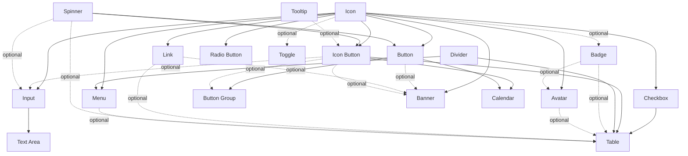

# Component Catalog

Single source for: which components the package supports, their build order, and the per-component checklist that Review, Plan, Build, Test and Document use.

A component outside this catalog needs a `DEC-*` (and a new catalog entry) before Plan.

## 1. Tiers

| Tier | Components | Why |
|---|---|---|
| **Tier 0 — Primitive components** | Icon, Spinner, Divider, Tooltip, Icon Button, Menu | Nested inside many Tier 1 components. Must exist before them |
| **Tier 1 — Foundation components** | Button, Button Group, Input, Text Area, Avatar, Toggle, Checkbox, Radio Button, Calendar, Table, Banner, Badge, Link | Consumer-facing building blocks |

Both tiers use the full workflow (Review → Plan → Build → Test → Document). Tier 0 contracts are usually smaller.

## 2. Build order (dependency graph)

A component may only be Approved for Build when every **Required** dependency below is `Built` or later on the same platform. Optional dependencies only block the configurations that use them.



Recommended order per platform:

```text
1 Icon → 2 Spinner, Divider → 3 Tooltip → 4 Icon Button → 5 Menu
6 Button → 7 Link → 8 Badge → 9 Avatar → 10 Checkbox, Radio Button, Toggle
11 Input → 12 Text Area → 13 Button Group → 14 Banner → 15 Calendar → 16 Table
```

`/ds-run-workflow` and `/ds-plan` check this graph and stop with `Blocked: dependency {X} / {Platform} not Built` when a Required dependency is missing.

## 3. Per-component checklist

Columns used below:

- **Anatomy**: parts (optional in brackets).
- **Typical controls**: starting point for Plan Table B. The contract decides.
- **States**: Web / App. `focus` is Web keyboard focus; apps use `pressed`.
- **Direction**: RTL level per [language-direction.md](../standards/language-direction.md) §3.
- **Runtime pattern**: WAI-ARIA Authoring Practices (APG) pattern for the developer handoff.

### Tier 0

#### Icon
- Anatomy: Glyph (vector) inside a fixed square frame.
- Typical controls: `Name` (instance swap or variant), `Size` (xs–xl). Color via semantic icon token on the glyph.
- States: none (inherits from parent).
- Direction: Level 1. Directional glyphs come as mirrored pairs in the library (`arrow-start` / `arrow-end`) or are flipped by the parent's direction helper.
- Runtime: decorative (`aria-hidden`) or meaningful (`role="img"` + label).
- Test focus: no raw fills, square frame stays fixed, glyph is a vector not an image, color bound to a token.

#### Spinner
- Anatomy: Track, Indicator.
- Typical controls: `Size`, `Tone` (on-surface / on-brand).
- States: none. Motion documented; reduced-motion alternative described.
- Direction: Level 1 (rotation direction stays the same).
- Runtime: `role="status"` with text, or indeterminate `progressbar`.
- Test focus: contrast of indicator ≥ 3:1 (A11Y-003), non-motion cue documented.

#### Divider
- Anatomy: Line, [Label].
- Typical controls: `Orientation` (horizontal / vertical), `Inset` (none / start / both).
- Direction: Level 2 only when `Inset = start` or a label exists; otherwise Level 1.
- Runtime: `separator` or decorative.
- Test focus: bound to divider token; APCA |Lc| ≥ 15.

#### Tooltip
- Anatomy: Container, Text, [Arrow].
- Typical controls: `Placement` (top / bottom / start / end), `Text`.
- Direction: Level 2 for `start/end` placement and arrow side.
- Runtime: APG Tooltip pattern (shown on focus and hover; dismiss with Escape).
- Test focus: text contrast, max width with long EN/AR, no clipping of arrow.

#### Icon Button
- Anatomy: Container, Icon, [Spinner], [Badge dot].
- Typical controls: `Hierarchy`, `Size`, `State`, `Icon` (instance swap), `Loading` (boolean).
- States: Web default / hover / focus / pressed / disabled / [selected] / [loading]; App default / pressed / disabled / [selected] / [loading].
- Direction: Level 1 for generic icons; directional icons follow the mirroring rules.
- Runtime: APG Button (`aria-label` required; `aria-pressed` when toggle).
- Test focus: target size ≥ platform minimum even when visual is small; documented accessible name.

#### Menu
- Anatomy: Surface, Menu items (Icon, Label, [Shortcut], [Check]), [Divider], [Section title].
- Typical controls: `Density`, item booleans for icon/shortcut/check.
- States (item): default / hover / focus / pressed / selected / disabled.
- Direction: Level 2 on the menu item (icon/label/shortcut order, submenu chevron mirrors).
- Runtime: APG Menu / Menu Button.
- Test focus: item height = target size, elevation via Effect Style, long labels truncate per contract.

### Tier 1

#### Button
- Anatomy: Container, [Leading icon], Label, [Trailing icon], [Spinner].
- Typical controls: `Hierarchy` (primary / secondary / tertiary / destructive), `Size`, `State`, `Leading icon` / `Trailing icon` (boolean + instance swap), `Label` (text), `Loading`.
- States: Web default / hover / focus / pressed / disabled / [loading]; App default / pressed / disabled / [loading].
- Direction: Level 2 helper `.Button/Content` (icon + label order; directional trailing arrow flips).
- Runtime: APG Button.
- Test focus: focus ring token, disabled contrast policy, label truncation vs wrap, min target, loading keeps width stable.

#### Button Group
- Anatomy: Container, Buttons (instances), [Overflow Icon Button].
- Typical controls: `Orientation`, `Attached` (boolean), `Selection` (none / single / multiple).
- States: per child; group-level focus order documented.
- Direction: Level 2 (child order flips; primary/destructive **meaning** and hierarchy are kept).
- Runtime: APG Toolbar (actions) or Radio Group (segmented single choice).
- Test focus: children are instances, spacing token, wrap behavior, RTL order keeps primary action position per `DEC-*`.

#### Input
- Anatomy: Label, [Required mark], Field (Container, [Leading icon], Value / Placeholder, [Trailing icon / Icon Button]), [Helper], [Error], [Counter].
- Typical controls: `Size`, `State`, `Leading icon`, `Trailing action`, `Label` / `Helper` / `Placeholder` / `Value` (text), `Required` (boolean).
- States: default / hover (Web) / focus / filled / error / disabled / read-only.
- Direction: Level 2 helper for the field row and Fill-width helper/error text alignment. Values like email/phone stay LTR.
- Runtime: native `input` with `label`, `aria-describedby` for helper/error, `aria-invalid`.
- Test focus: border contrast ≥ 3:1 (A11Y-003), error not color-only, placeholder |Lc| ≥ 30, read-only vs disabled visually distinct.

#### Text Area
- Anatomy: as Input, Field is multiline, [Resize handle], [Counter].
- Typical controls: `Size`, `State`, `Rows` (min), `Resizable` (boolean), text props.
- States: as Input.
- Direction: Level 2 (counter position, resize handle side mirrors).
- Runtime: native `textarea`.
- Test focus: min height, long AR wraps, counter overlap.

#### Avatar
- Anatomy: Container, Image | Initials | Icon fallback, [Status badge].
- Typical controls: `Size`, `Type` (image / initials / icon), `Status` (boolean + instance).
- Direction: Level 1; status badge position may mirror (`DEC-*`). Never mirror photos.
- Runtime: `img` with alt, or text initials with accessible name.
- Test focus: initials contrast on every background token, size scale tokens.

#### Toggle
- Anatomy: Track, Knob, [Label], [Helper].
- Typical controls: `Checked`, `State`, `Size`, `Label position` (start / end).
- States: off / on × default / hover (Web) / focus / pressed / disabled.
- Direction: Level 2 — knob position and travel mirror in RTL; On/Off meaning unchanged.
- Runtime: APG Switch.
- Test focus: track contrast ≥ 3:1 in both states, non-color cue for On (knob position), label order.

#### Checkbox
- Anatomy: Box, [Check / Indeterminate glyph], [Label], [Helper].
- Typical controls: `Checked` (unchecked / checked / indeterminate), `State`, `Size`.
- States: × default / hover (Web) / focus / pressed / disabled / error.
- Direction: Level 2 (box + label order). Check glyph does not mirror.
- Runtime: APG Checkbox.
- Test focus: outline contrast ≥ 3:1, hit area includes label, indeterminate distinct from checked.

#### Radio Button
- Anatomy: Circle, [Dot], [Label], [Helper].
- Typical controls: `Selected`, `State`, `Size`.
- States: as Checkbox (no indeterminate).
- Direction: Level 2 (circle + label order).
- Runtime: APG Radio Group.
- Test focus: as Checkbox; group spacing documented.

#### Calendar
- Anatomy: Header (Month label, Prev/Next Icon Buttons), Weekday row, Day cells, [Footer actions].
- Typical controls: `View` (day / month / year), `Selection` (single / range), cell states via a private `.Calendar/Cell` set.
- States (cell): default / hover / focus / selected / range-start / range-middle / range-end / today / disabled / out-of-month.
- Direction: Level 2 — grid order mirrors, Prev/Next arrows mirror, digits never reverse; week start is a product `OQ-*`.
- Runtime: APG Date Picker Dialog / Grid.
- Test focus: today vs selected not color-only, range end caps in RTL, dense cell targets.

#### Table
- Anatomy: Header row (cells, sort icons), Body rows (cells: text, Checkbox, Avatar, Badge, Link, actions), [Toolbar], [Pagination], [Empty / loading state].
- Typical controls: `Density`, `Row state`, private `.Table/Cell` and `.Table/Row` sets.
- States (row): default / hover (Web) / selected / disabled; cell focus for interactive grids.
- Direction: Level 2 on rows and header; column **meaning** kept (selection column stays at reading start, actions at reading end).
- Runtime: native `table`, or APG Grid when cells are interactive; sortable headers per APG Sortable Table.
- Test focus: all nested parts are instances, numeric alignment, long content truncation, row height = target size on apps.

#### Banner
- Anatomy: Container, Status icon, Title, Body, [Actions (Button/Link)], [Dismiss Icon Button].
- Typical controls: `Tone` (info / success / warning / error), `Dismissible`, `Actions` (boolean).
- Direction: Level 2 (icon → title/body → actions → dismiss in reading order).
- Runtime: `role="status"` (polite) or `role="alert"` (urgent) per tone; dismiss button labeled.
- Test focus: tone not color-only (icon + text), body contrast on tinted backgrounds, wrap with long AR.

#### Badge
- Anatomy: Container, Label | Dot | Count, [Icon].
- Typical controls: `Tone`, `Size`, `Type` (label / dot / count), `Icon`.
- Direction: Level 1 (Level 2 if icon + label).
- Runtime: text content; `role="status"` only if it updates live.
- Test focus: small text contrast (|Lc| ≥ 60), count overflow (`99+`), not interactive by default.

#### Link
- Anatomy: Label, [Trailing icon (external / arrow)].
- Typical controls: `Tone` (default / subtle / inverse), `State`, `Underline`, `Icon`.
- States: default / hover / focus / pressed / visited / disabled (Web); default / pressed / visited / disabled (App).
- Direction: Level 2 when an icon exists; arrow icon mirrors, external icon does not.
- Runtime: native `a`.
- Test focus: link distinguishable from body text without color alone (underline or 3:1 + cue), visited contrast.
